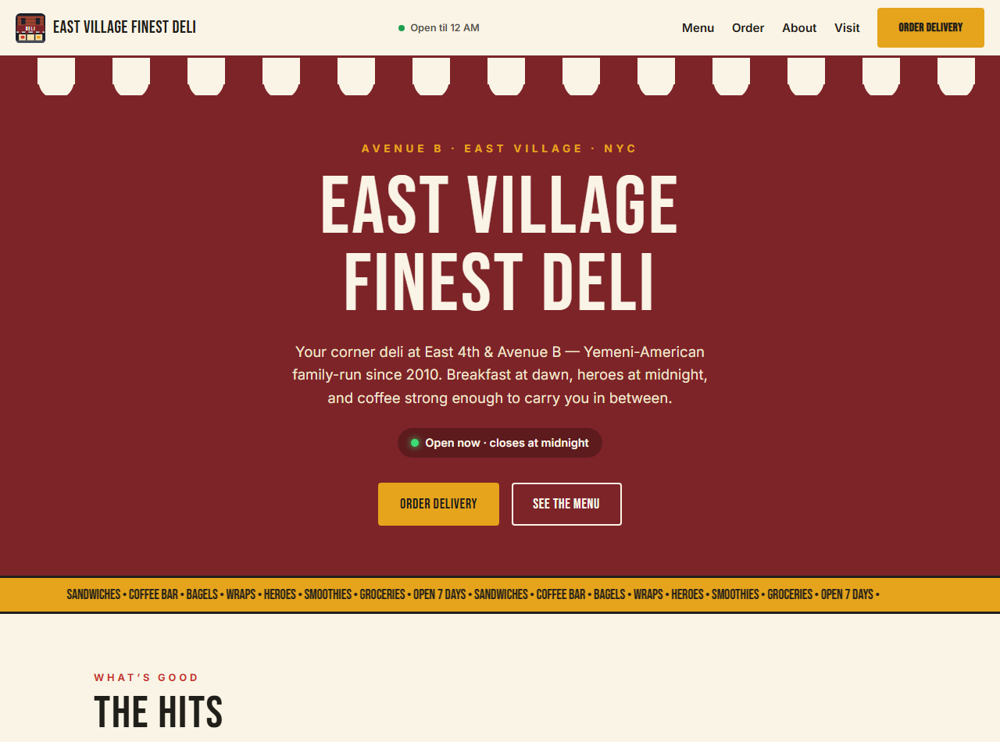

# East Village Finest Deli — fan site

**Live site: [bjornswanson0.github.io/east-village-finest-deli](https://bjornswanson0.github.io/east-village-finest-deli/)**

An unofficial fan site for East Village Finest Deli — the Yemeni-American, family-run corner deli that has anchored East 4th & Avenue B since 2010. I live across the street, most of my breakfasts come off their grill, and a place this good deserved a better web presence than a delivery-app listing. So I built one. If the family ever wants it, it's theirs.

## What's on it

- Live **open-now status** computed in the deli's timezone (6 AM–midnight, 1 AM on weekends), echoed in the sticky nav
- **Hand-drawn SVG art** — the storefront at night, drawn from the real corner, with a miniature of it as the nav badge. No stock photos, no lifted images
- **The Hits** — the real most-ordered items from the delivery menus, each with an order link
- Ordering links for Grubhub, Seamless, DoorDash, and Uber Eats, real review quotes, hours with today's row highlighted, and an embedded map
- Restaurant schema.org markup, social-share card, reduced-motion support, skip link and keyboard-accessible nav

## Stack

Hand-written HTML, CSS, and vanilla JavaScript — no framework, no build step. Hosted on GitHub Pages.
